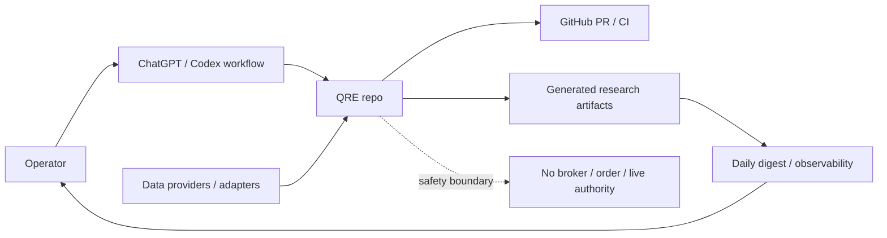
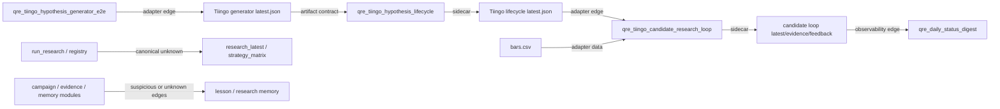
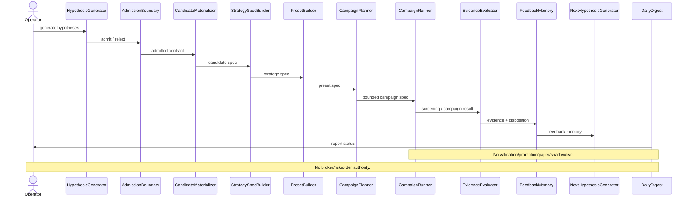
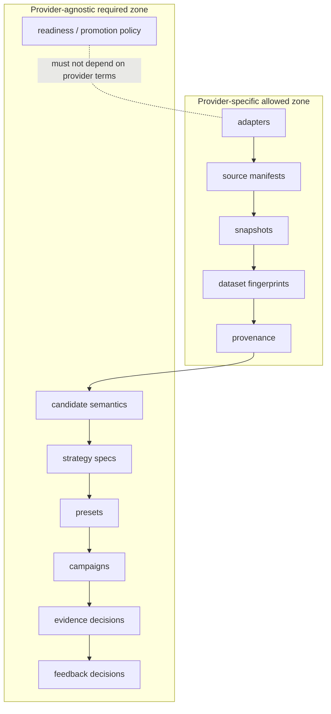

# QRE Funnel Visual Maps

This audit uses C4-style context/container/component diagrams, data-flow diagrams, integration/dependency diagrams, and sequence diagrams.

It does not prioritize infrastructure diagrams because this audit is about research architecture, artifact contracts, provider leakage, and funnel ownership, not servers, networks, load balancers, or deployment topology.

## Diagram 1 C4 Context: QRE Research System Boundary

## Diagram 2 C4 Container/Component: Current Detected Funnels

```mermaid
flowchart TB
    subgraph TiingoMiniLoop[Tiingo mini-loop]
        TGen[qre_tiingo_hypothesis_generator_e2e.py]
        TLife[qre_tiingo_hypothesis_lifecycle.py]
        TCand[qre_tiingo_candidate_research_loop.py]
        TArt[logs/qre_tiingo_*]
        TGen --> TLife --> TCand --> TArt
    end

    subgraph AlphaCampaign[Alpha discovery / Strategy IR / campaign funnel]
        Alpha[alpha discovery modules]
        StrategyIR[Strategy IR semantics]
        Campaign[campaign modules]
        Lessons[lesson / memory / disposition modules]
        Alpha --> StrategyIR --> Campaign --> Lessons
    end

    subgraph LegacyRun[Canonical or legacy run_research / registry / matrix funnel]
        Registry[registry.py]
        Strategies[agent/backtesting/strategies.py]
        RunResearch[research/run_research.py]
        Matrix[research_latest.json / strategy_matrix.csv]
        Registry --> RunResearch
        Strategies --> RunResearch --> Matrix
    end

    subgraph Observability[Daily digest observability funnel]
        Sidecars[logs/**/latest.json]
        Digest[qre_daily_status_digest.py]
        Summary[operator_summary.md]
        Sidecars --> Digest --> Summary
    end
```

## Diagram 3 Target Canonical Data-Flow Architecture

```mermaid
flowchart LR
    Adapter[DataProviderAdapter]
    SourceSnapshot[SourceSnapshot]
    ObservationSnapshot[ObservationSnapshot]
    Hypothesis[Hypothesis]
    Contract[ResearchInputContract]
    Candidate[CandidateSpec]
    Strategy[StrategySpec / Strategy IR]
    Preset[PresetSpec]
    Campaign[CampaignSpec]
    Run[CampaignRun / ScreeningResult]
    Evidence[EvidencePack / EvidenceLedger]
    Feedback[Disposition / FeedbackRecord / LessonMemory]
    Next[Next HypothesisBatch]

    Adapter --> SourceSnapshot --> ObservationSnapshot --> Hypothesis --> Contract --> Candidate --> Strategy --> Preset --> Campaign --> Run --> Evidence --> Feedback --> Next
    SourceSnapshot -. provider provenance allowed .-> Adapter
    Candidate -. provider-specific terms stop before here .- SourceSnapshot
    Preset -. provider agnostic required .- Campaign
```

Provider-specific terms stop at SourceSnapshot/provenance. PresetSpec and CampaignSpec must remain provider-agnostic.

## Diagram 4 Integration/Dependency Graph: Producer/Consumer Artifact Map

Canonical edges should converge through provider-agnostic contracts. Adapter edges can remain provider-specific. Observability edges must not become producers. Suspicious/unknown edges require settlement before being treated as canonical.

## Diagram 5 Sequence: Intended Full Canonical Loop

## Diagram 6 Provider Leakage Boundary

