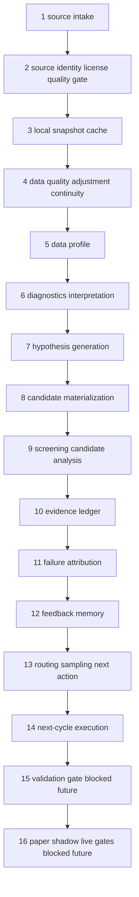

# QRE Loop Inventory

## Definitions

QRE is the Quant Research Engine: a deterministic research system for turning governed data sources into research-only profiles, hypotheses, candidates, screening evidence, failure memory, and bounded next-action recommendations. In this repo QRE is not a trading system. Its current authority stops at reproducible research artifacts and operator-readable evidence; it does not grant broker, order, risk, paper, shadow, or live authority.

ADE is the Autonomous Development Engine: the governed build/work-admission layer around repository change requests, implementation handoffs, and development controls. ADE may consume QRE evidence to prioritize engineering work, but it is not the QRE research loop and it must not become an independent strategy or trading authority.

QRE and ADE are distinct. QRE answers research questions from data and artifacts. ADE controls whether code or docs work is admitted and implemented. QRE may produce evidence that ADE reads; ADE may produce implementation records that QRE memory can index. Neither layer may bypass registry, validation, PR, or live-governance rules.

## Static Evidence

The static inventory tool added in this PR scans `research/`, `packages/`, `reporting/`, and `tools/` with AST/text inspection only. A local run on this branch found 515 Python modules, 14,925 findings, 903 `report_kind` findings, 910 artifact path constant findings, 354 likely producer modules, and 276 likely consumer modules. These are static findings, not proof that every module participates in a live runtime chain.

Key working anchor: `research/qre_tiingo_hypothesis_generator_e2e.py` has direct tests in `tests/unit/test_qre_tiingo_hypothesis_generator_e2e.py` and docs in `docs/research/tiingo_hypothesis_generator_e2e.md`. It resolves `tiingo_eod_equities_free`, requires snapshot `qdsnap_2b1258c6f592fa08`, loads local OHLC bars, applies split-like continuity adjustment, builds data profiles, runs real/shuffled/truncated controls, emits data-driven hypothesis seeds, and keeps `trading_authority=false`.

## Canonical Loop

## Maturity Definitions

| maturity | definition |
|---|---|
| missing | Expected capability exists in the target loop but no clear module/artifact/test is found. |
| scaffold | Module/artifact/docs exist, but no proven producer-consumer chain or meaningful test evidence is found. |
| working | Producer, artifact, tests, and at least one plausible consumer or explicit operator run evidence exist. |
| trusted | Working + fail-closed behavior + lineage + negative tests/null controls + operator summary + no authority leakage. |

## Per-Layer Inventory

| layer | purpose | modules | input artifacts | output artifacts | tests | authority | maturity | gaps |
|---|---|---|---|---|---|---|---|---|
| 1 source intake | Register and describe usable external sources. | `research.external_intelligence.*`, `packages.qre_research.alpha_discovery.providers` | source manifests | source registry rows | source onboarding/source manifest tests | research source context only | working | Not all source paths are tied to the Tiingo E2E chain. |
| 2 source identity / license / quality gate | Decide evidence tier and blockers. | `packages.qre_research.alpha_discovery.source_qualification`, `source_resolution` | dataset catalog, snapshot lineage, source qualifications | `generated_research/alpha_discovery/source_qualifications/latest.json`, `generated_research/alpha_discovery/source_resolution/latest.json` | `test_qre_alpha_snapshot_resolution.py`, `test_qre_alpha_source_qualification.py`, `test_qre_source_onboarding.py` | screening eligibility only | working | Validation tier is referenced but not in safe next scope. |
| 3 local snapshot/cache | Keep immutable local data evidence. | `packages.qre_research.alpha_discovery.snapshot_lineage`, data catalog modules | imported/cache data | snapshot lineage/catalog artifacts | snapshot lineage tests | local research cache | working | Cache producers are not uniformly consumed by later QRE routes. |
| 4 data quality adjustment / continuity | Make research prices continuous without changing trading authority. | `research.qre_tiingo_hypothesis_generator_e2e` | Tiingo bars CSV | in-memory adjusted profile; optional `logs/qre_tiingo_hypothesis_generator_e2e/latest.json` | `test_qre_tiingo_hypothesis_generator_e2e.py` | research-only | trusted | Output is not a canonical candidate input. |
| 5 data profile | Summarize coverage, returns, vol, ranks, clusters, fingerprints. | `research.qre_tiingo_hypothesis_generator_e2e` | adjusted Tiingo bars | data profile inside Tiingo report | Tiingo E2E tests | research-only | trusted | Profile has no downstream resolver into candidate materialization. |
| 6 diagnostics / interpretation | Interpret market behavior and evidence quality. | many `reporting/qre_*diagnostics*`, `research/diagnostics/*`, `packages/qre_diagnostics/*` | existing sidecars/research outputs | diagnostic sidecars under `logs/` | many unit tests by module | advisory/read-only | scaffold | Diagnostics are broad but not clearly chained to the Tiingo profile. |
| 7 hypothesis generation | Produce bounded data-derived research hypotheses. | `research.qre_tiingo_hypothesis_generator_e2e`, `packages.qre_research.automated_hypothesis_generation`, alpha discovery modules | data profile, source resolution | Tiingo hypothesis payload; generated hypothesis sidecars | Tiingo E2E and hypothesis tests | screening-only, not trade signal | working | Tiingo hypotheses are not consumed by candidate materialization. |
| 8 candidate materialization | Convert approved strategy/preset/hypothesis context into candidates. | `research.candidate_pipeline`, `research.candidate_registry_v2`, `reporting/qre_selection_route_materialization.py` | strategy registry, presets, run candidates | `research/run_candidates_latest.v1.json`, candidate registry sidecars | candidate pipeline/registry tests | research candidate context | scaffold | Not wired to Tiingo data-driven hypotheses. |
| 9 screening / candidate analysis | Analyze candidate evidence and screening result. | `research.run_research` legacy path, candidate scoring, screening evidence modules | candidates, run outputs | screening evidence/run artifacts | many run/candidate tests | research screening only | scaffold | This audit did not execute runtime screening; Tiingo path stops before this layer. |
| 10 evidence ledger | Preserve cross-run evidence and campaign events. | `research.campaign_evidence_ledger`, evidence reporting modules | campaign events, screening/funnel evidence | campaign evidence JSONL/meta sidecars | `test_campaign_evidence_ledger.py` | append-only research evidence | working | Ledger is not fed by Tiingo hypothesis E2E output. |
| 11 failure attribution | Map failures to bounded reason/action records. | `reporting/qre_actionable_failure_taxonomy.py`, `reporting/adaptive_research_learning_minimal.py` | campaign/evidence artifacts | failure taxonomy and learning sidecars | targeted reporting tests | advisory only | scaffold | No proven Tiingo-to-failure-attribution route. |
| 12 feedback memory | Index local artifacts and failures for retrieval. | `packages.qre_research.research_memory`, legacy `research/qre_research_memory_*` | public outputs and selected `logs/` sidecars | `logs/qre_research_memory/latest.json`, history JSONL | package migration and memory tests | read-only memory | working | Default artifact list omits Tiingo E2E output. |
| 13 routing / sampling / next action | Choose bounded next actions from evidence. | `reporting/qre_routing_sampling_readiness.py`, sampling/routing reports, `qre_selection_closed_loop_preflight.py` | memory/evidence/bridge sidecars | routing/sampling/preflight sidecars | routing/sampling/preflight tests | advisory; no execution | scaffold | Decisions are not proven to feed a later Tiingo-aware run. |
| 14 next-cycle execution | Execute next research cycle. | campaign launcher/run research modules exist | route/campaign artifacts | run artifacts | launcher/run tests exist | runtime research, out of this PR scope | scaffold | Not invoked and not audited as working for Tiingo. |
| 15 validation gate | Controlled validation eligibility and request surfaces. | validation request/reporting modules | candidate/evidence artifacts | validation request/result sidecars | validation tests | blocked/future for this audit | scaffold | Stop before implementing or calling validation. |
| 16 paper/shadow/live gates | Paper, shadow, live readiness and future package boundaries. | `packages/qre_paper`, `packages/qre_shadow`, `packages/qre_live` plus legacy readiness reports | validation/evidence artifacts | readiness sidecars/scaffolds | gate tests | blocked/future; no runtime authority | scaffold | Future-only or hard-disabled; no activation allowed. |
